# ***```SmartFlow Decision-Making Platform```***

## ```Overview```

### **SmartFlow** is a full-stack, government-grade decision-making platform that connects with the SmartFlow Reporting App to process, visualize, and act on water leakage reports submitted by citizens. It empowers government agencies to monitor leaks in real-time, assign resources, plan interventions, and analyze trends for infrastructure planning and urban water management.

---

## 💡 Key Features

- ✅ Live integration with the SmartFlow Reporting App
- ✅ Role-based access for Admins, Analysts, Planners, Inspectors
- ✅ Interactive admin dashboards with maps, charts, and tables
- ✅ Leak density heatmaps, high-priority zone detection
- ✅ Resource allocation view for field team deployment
- ✅ Exportable insights and historical reporting

---

## 🎯 Use Case

This platform is designed for **government departments and public water authorities** to:
- Detect and respond to leak-prone zones quickly
- Simulate and plan field interventions
- Track inspection status and performance metrics
- Gain insights into long-term leakage trends
- Make data-driven decisions for infrastructure repair

---

## 🧭 Landing Page

<div align="center">

  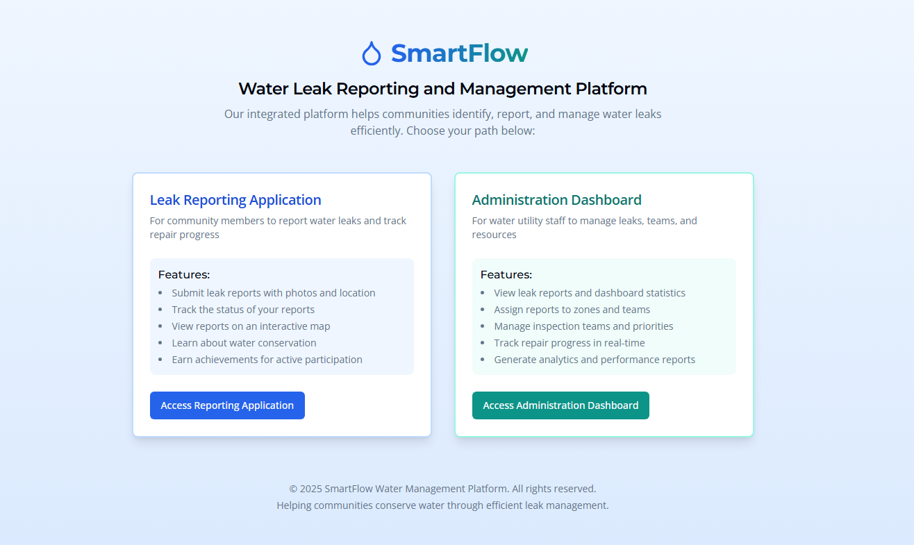
  
</div>

---

## 🎛️ Admin Dashboard

<div align="center">

  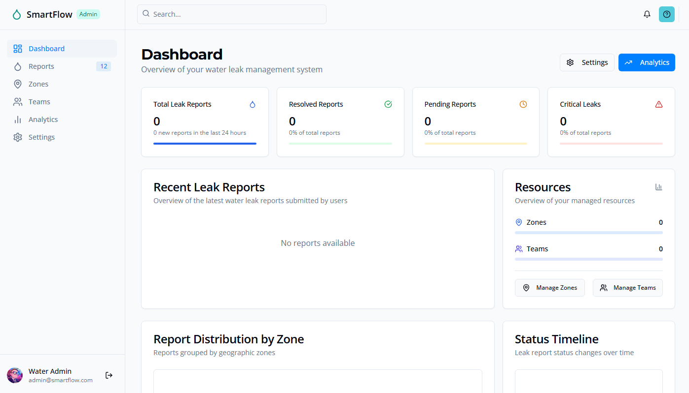
  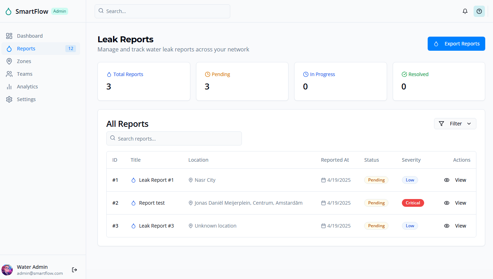

  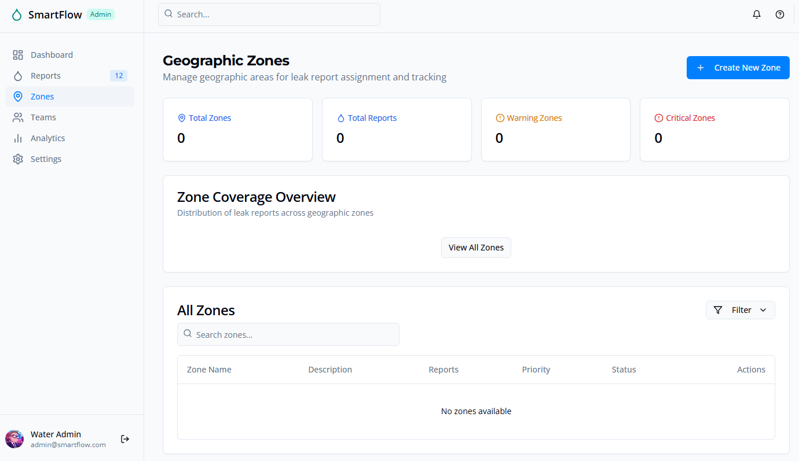
  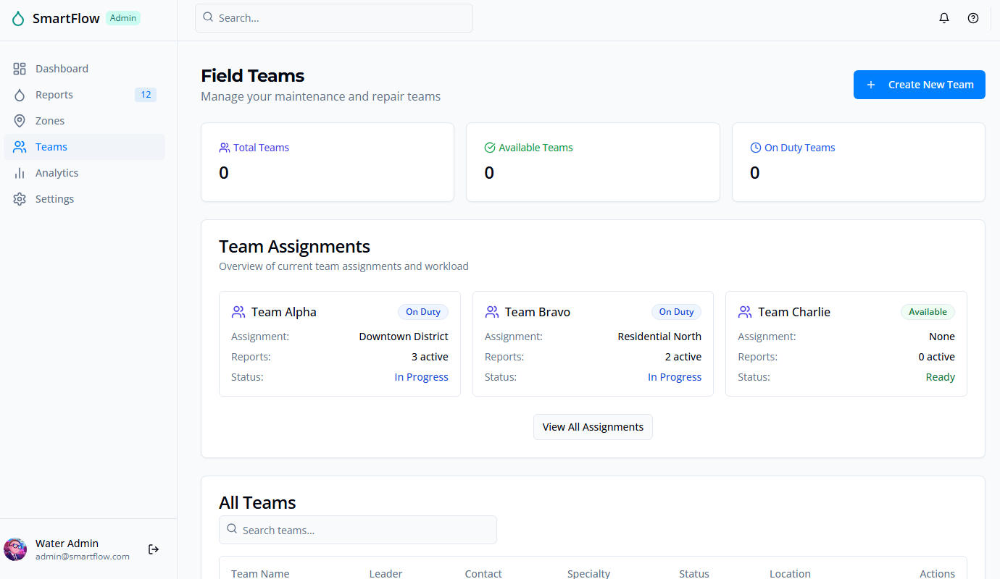
  
  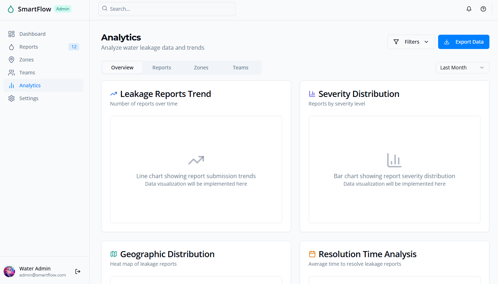
  
</div>

---

## 📱 Reporting App Screenshots

The reporting app enables citizens to capture leaks via text, voice notes, photos, and GPS. Reports are submitted anonymously or with an account.

<div align="center">


  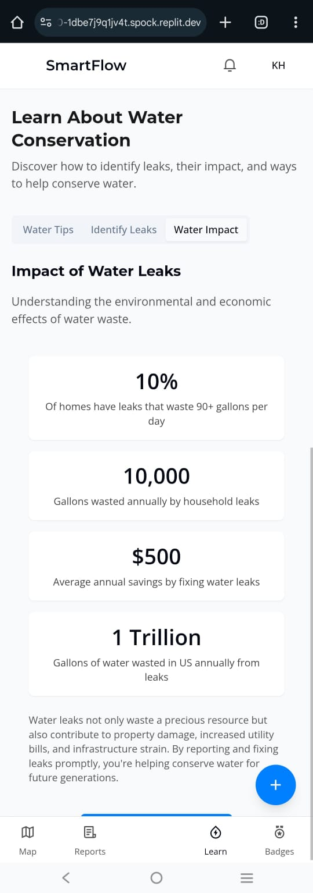
  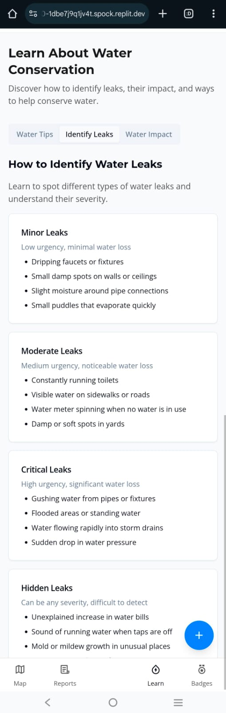
  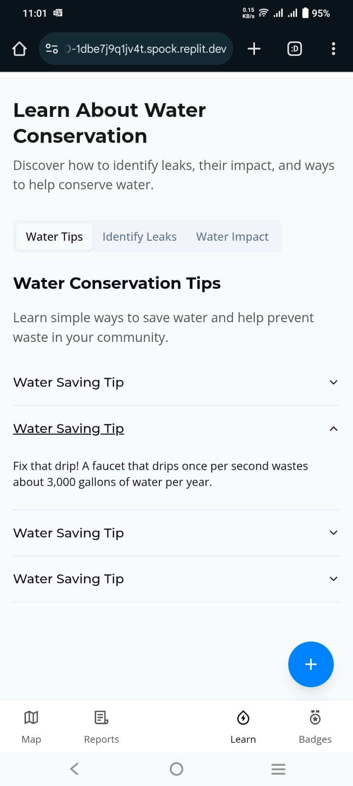
  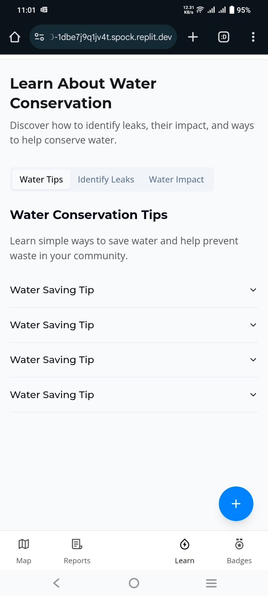
  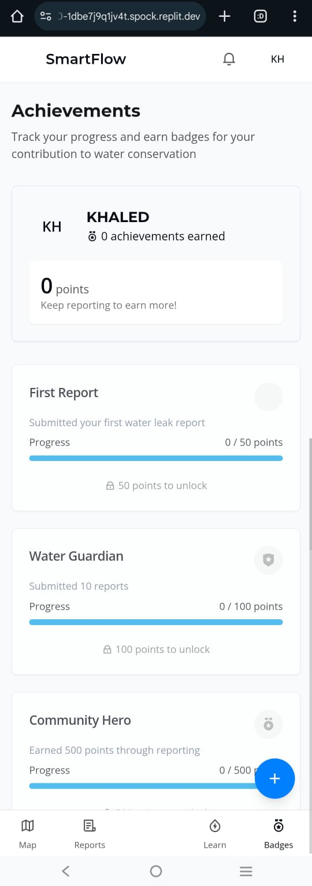
  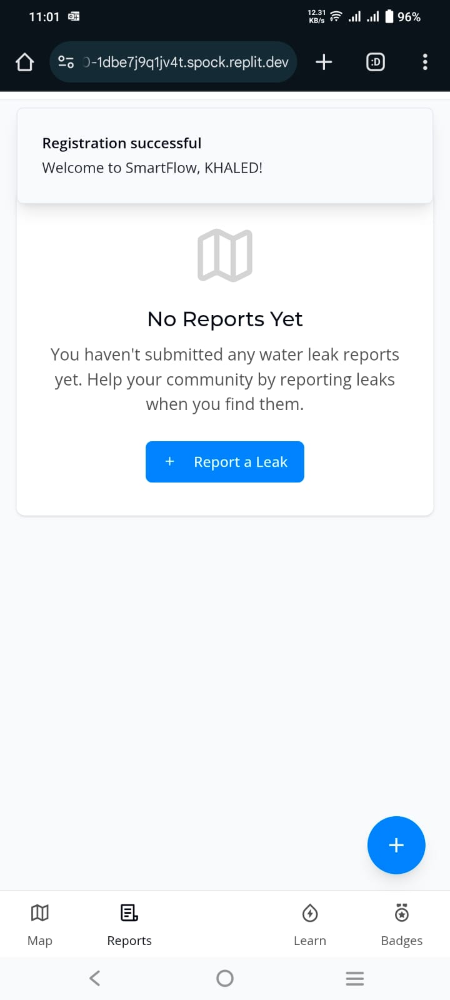
  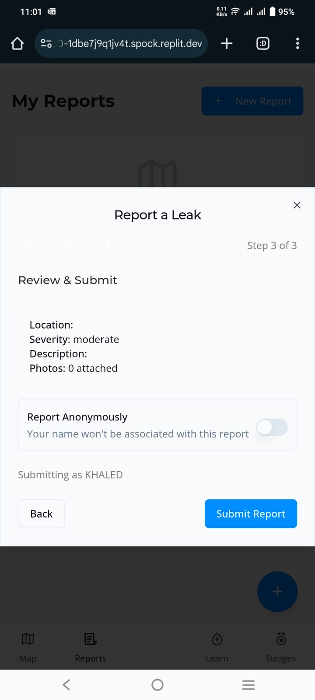
  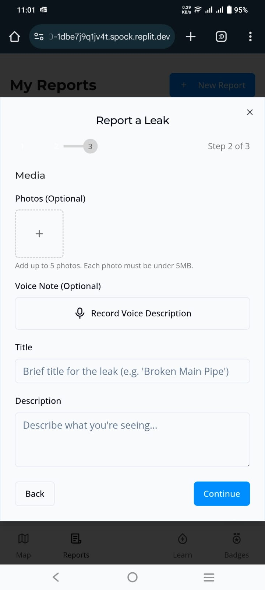
  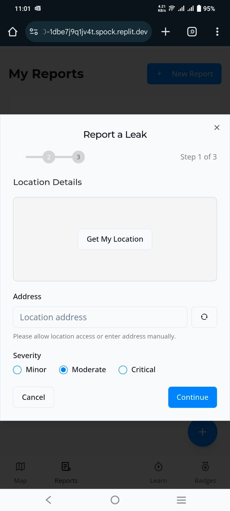
  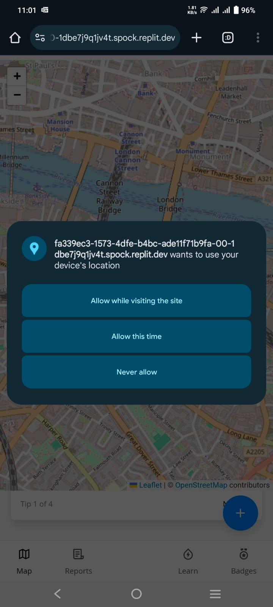

</div>

---

## ⚙️ System Requirements

- OS: Windows 10/11, macOS 10.10+, or Linux
- Node.js: 14+
- npm: 6+
- MongoDB: 4.0+
- Modern web browser (Chrome, Firefox, Edge)

---

## 🚀 Installation & Setup

### 1. Clone the Repository

```bash
git clone https://github.com/THEKINGSTAR/Smart_Flow.git
cd Smart_Flow
```

### 2. Backend Setup

```bash
cd backend
npm install
```

### 3. Frontend Setup

```bash
cd ../frontend
npm install
```

### 4. Environment Configuration

Create a `.env` file in the `/backend` directory with:

```env
PORT=5000
MONGODB_URI=your_mongodb_connection_string
JWT_SECRET=your_jwt_secret
REPORTING_APP_API_BASE=https://your-reporting-app-url.com
```

### 5. Start the Application

- Start the backend:
```bash
cd backend
npm start
```

- Start the frontend:
```bash
cd frontend
npm start
```

Access the platform at: `http://localhost:3000`

---

## 🧱 Folder Structure

```
Smart_Flow/
├── backend/
│   ├── controllers/
│   ├── models/
│   ├── routes/
│   ├── services/
│   ├── middlewares/
│   ├── jobs/
│   └── index.js
├── frontend/
│   ├── components/
│   ├── pages/
│   ├── services/
│   └── App.jsx
├── shared/
│   └── constants/
├── Screens/
├── README.md
```

---

## 👥 User Roles

| Role       | Access                                      |
|------------|---------------------------------------------|
| Admin      | Full control, user & report management      |
| Planner    | Resource assignment & intervention planning |
| Analyst    | Visual insights & dashboard data            |
| Inspector  | Field task updates & report status changes  |

---

## 📡 Key API Endpoints

- `GET /api/dashboard/summary` – Dashboard KPIs
- `GET /api/reports/zone/:zoneId` – Reports by zone
- `GET /api/reports/high-priority` – Priority reports
- `PUT /api/reports/:id/status` – Update status
- `POST /api/users/login` – User login
- `POST /api/users/signup` – User registration
- `GET /api/users/me` – Fetch logged-in user

---

## 📊 Future Enhancements

- Email/SMS alert triggers
- Crew GPS live sync
- AI-based image report scoring
- Infrastructure damage prediction models
- Arabic and multilingual UI support

---

## 📄 License

This project is licensed under the [MIT License](LICENSE).

---

## 🙌 Contribution

We welcome issues, pull requests, and forks. If you're interested in helping us improve the SmartFlow platform — get involved!

---

[Back to Top](#smartflow-decision-making-platform)
